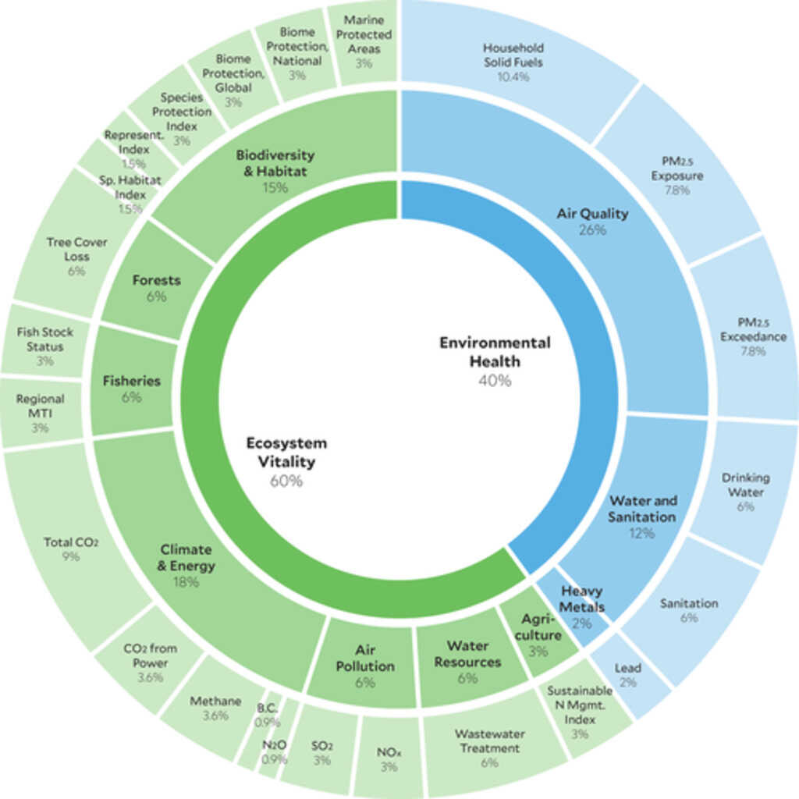

```{r setup, include=FALSE}
library(InequalityEnvironment)
library(kableExtra)
library(tidyverse)
library(huxtable)
library(car)
library(GGally)
library(plotly)
library(here)
knitr::opts_chunk$set(echo = FALSE)
def <- knitr::knit_hooks$get("output")
knitr::knit_hooks$set(output = function(x, options) {
  x <- def(x, options)
  ifelse(!is.null(options$suppress), gsub(pattern = "```.*```", "", x), x)
})
```

## Environmental degradation $\rightarrow$ greater inequality:

* focused on $CO_2$ and climate change:

> Global warming has very likely exacerbated global economic inequality, including ∼25% increase in population-weighted between-country inequality over the past half century.  @diffenbaugh2019global

> Climate change and climate variability worsen existing poverty, exacerbate inequalities, and
trigger both new vulnerabilities and some opportunities for individuals and communities. @olsson2014livelihoods

> Poverty and persistent inequality are the most salient of the conditions that shape climate-related vulnerability. @ribot2013vulnerability 

## Greater inequality $\rightarrow$ environmental degradation.

* Possible mechanisms for reverse causality:

1)  The environmental footprint of the wealthy. 

>The income share of the top 10% increases [U.S. state-level] CO2 emissions. @jorgenson2017income

{height=250px}&emsp;&emsp;{height=250px}&emsp;&emsp;{height=250px}

2)  People living in poverty have more pressing concerns than making enviro-friendly choices.

{height=250px}&emsp;&emsp;{height=250px}

## 1000 rivers with highest plastic output:


## Missmanaged Plastic Waste Per Capita

{height=600px}

## Other mechanisms:

1) Political economy: the rich have a preference for more pollution. The greater the resources the rich have, the more likely they are able to "buy" lax environmental regulation. @boyce1994inequality

2) @ravallion2000carbon and @levinson2019environmental find that emissions are *lower* with higher inequality. 

{height=300px}

  -  Environmental Engel Curves are concave because savings rates increase and/or preferences shift towards less pollution intensive goods when income increases. 

3) inequality makes collective action more difficult. @ostrom1990governing

4) Inequality might create perverse incentives e.g. conspicuous consumption, @corneo1997conspicuous, labour market rat race, @landers1996rat, to the detriment of the environment. @bowles2005emulation

## Inequality and Intensive Margin of Labour Supply

```{r, warning=FALSE,message=FALSE, fig.height=9, fig.width=16}
ggplotly(rr) %>%
  animation_opts(transition = 0)
```

## The planetary boundaries:

{ height=50% }
<figcaption>source: J. Lokrantz/Azote based on @steffen2015planetary </figcaption>

* We are in the midst of the world's 6th extinction crisis: @pimm1995future, @lawton1995extinction, @de2015estimating, @pimm2014biodiversity, @diaz2019global.

* 8 billion mouths to feed has created great stress on nitrogen and phosphorus cycles.

* What is needed is a measure of how well we are doing at addressing this multifaceted problem.

## Environmental Performance Index:

* Environmental Performance Index (EPI) is a data-driven summary of the state of sustainability based on 32 performance indicators across 11 issue categories.

{height=500px}

* EPI scores are available for the years `r sort(unique(epi_data$year))`, but

> Because the underlying methodology and data change between versions of the EPI, it is not appropriate to assemble the scores from each release into a time series (https://epi.yale.edu/faq/epi-faq) 

## EPI time series.

```{r, warning=FALSE, fig.height=9, fig.width=16}
epi_vs_year
```

## How the sausage is made:

```{r, warning=FALSE, fig.height=9, fig.width=16}
yearly_indicator_diff
```

## Econometric theory

> ... is like an exquisitely balanced French recipe, spelling out precisely with how many turns to mix the sauce, how many carats of spice to add, and for how many milliseconds to bake the mixture at exactly 474 degrees of temperature. But when the statistical cook turns to raw materials, he finds that hearts of cactus fruit are unavailable, so he substitutes chunks of cantaloupe; where the recipe calls for vermicelli he uses shredded wheat; and he substitutes green garment dye for curry, ping-pong balls for turtle's eggs and, for Chalifougnac vintage 1883, a can of turpentine (Stefan Valavanis)

{width=4,height=4}


## Domestic inequality over time:

```{r,warning=FALSE, fig.height=9, fig.width=16}
gini_plot
```

* Most of the variation is between countries, not over time.

## Approach taken:

* Because:

1)    EPI scores seem a little dodgy
2)    Within country inequality is highly stable over time 

* perform cross-sectional OLS on time-averaged data.
* control for confounds.
* use robust standard errors.
* do not put much faith in results.
* run an experiment to test for causal relationship. 

## Log(GDP/Capita) vs. EPI scores

```{r, message=FALSE, fig.height=8, fig.width=15}
wealth_vs_epi
```
<figcaption>data source: GDP/capita (World Bank) and EPI (@epi20)</figcaption>


## Log(GDP/Capita) vs. EPI scores

```{r, message=FALSE, fig.height=8, fig.width=15}
kuznet
```
<figcaption>data source: GDP/capita (World Bank) and EPI (@epi20)</figcaption>

## Strong positive correlation:

* Which way does the causality run?

1) Environmental health contributes to economic prosperity OR

2) Economic prosperity allows rich countries to take costly actions to protect the environment OR
    
3) Economic prosperity allows rich countries to outsource the production of environmentally damaging goods. 

    -  Trade data and standard EPI scores can be used to create a weighted EPI score that crudely addresses these leakages.

    -  The relationship between gdp/capita and epi scores still exists using this weighted EPI score.


## Confounds: wealth and governance.

```{r, warning=FALSE, fig.height=9, fig.width=16}
controls_pairs
```

## Measures of Inequality:

```{r, warning=FALSE, fig.height=9, fig.width=16}
inequality_pairs
```

## EPI ~ controls + inequality


```{r, warning=FALSE}
hr <- huxreg(regressions$rob_mod[[1]], regressions$rob_mod[[2]], regressions$rob_mod[[3]], regressions$rob_mod[[4]],
             omit_coefs=c("(Intercept)"),
             statistics = character(0))
hr$names <- hr$names%>%
  str_replace_all("_", " ")%>%
  str_to_title()
hr
```

## Cet Par:

* A 10% increase in GDP/capita is associated $\approx$ .4 unit increase in EPI score.
* A 10% increase in the bottom 50 share of income (from mean of .15) is associated with $\approx$ .6 unit increase in EPI score.
* A 10% decrease in the top 10 share of income (from mean of .45) is associated with $\approx$ 1 unit increase in EPI score.
* A 10% decrease in gini coefficient (from mean of 40) is associated with $\approx$ .8 unit increase in EPI score. 
* No strong relationship between EPI scores and the absolute number of people living in poverty.

* Caveat: EPI scores do not account for leakages between countries.  Next up: weighted EPI

## Emission Leakages:

*  Rich countries might have high EPI scores because they import, rather than produce, environmentally damaging goods.

    -  @levinson2009technology finds this only accounts for about 10% of the reduction in air pollution in the USA.
    
*  If we believe in *Homo economicus*, then the *entire* environmental impact should be attributed to (the country of) the consumer.

* In contrast, EPI scores attribute pollution to (the country of) the producer.
     
{height=300px}

* Attributing emissions to (the country of) the consumer is similar to the intent of the RICO Act: Pre-RICO, a person who instructed someone else to murder could be exempt from prosecution because they did not personally commit the crime.

## A smokestack is not a smoking gun

* at least not usually...

{}


## Using trade data to adjust EPIs   

* Create a weighted average of a country's EPI score and an import EPI.

* Consider Canada:

```{r}
kbl(canada)%>% 
  kable_styling(bootstrap_options = c("striped", "hover"), full_width = F)
```

Weight on import EPI is $w_{i}=\frac{M}{GDP-X+M}=$ 
`r round(canada[3,2]/(canada[1,2]-canada[2,2]+canada[3,2]),2)%>%pull()`

## Canada's import EPI:

```{r}
 kbl(canada_partners)%>%
   kable_styling(bootstrap_options = c("striped", "hover"), full_width = F)
```

* Import EPI is a weighted average of top 5 trading partner's EPI's.

* To calculate the weights we pretend each country *only* trades with these top five trade partners.


## Environmental accounting

* A non-exhaustive list of problems with my "back of the envelope" adjustment. 

    - Not all imports are for consumption, they might be re-exported e.g. Singapore.
    - The environmental impact of goods produced for export might differ from goods produced for domestic consumption.
    - Weights based on GDP,X,M (dollar values) are not appropriate for environmental impacts.
    - Even if weights based on dollar values were appropriate, I am only using top 5 trading partners.
    - your problem...

Some other attempts at environmental accounting

  -   cover a very limited set of countries/industries/pollutants: @muradian2002embodied
  
  -   focus exclusively on $CO_2$: @peters2011growth
  

## Rich countries look a little worse, poor countries look a little better.


```{r,warning=FALSE, fig.height=7.5, fig.width=7.5}
epi_vs_wepi
```

## import weighted EPI ~ controls + inequality


```{r, warning=FALSE}
hr <- huxreg(regressions$rob_mod[[5]],regressions$rob_mod[[6]],regressions$rob_mod[[7]],regressions$rob_mod[[8]], 
             omit_coefs=c("(Intercept)"),
             statistics = character(0))
hr$names <- hr$names%>%
  str_replace_all("_"," ")%>%
  str_to_title()
hr
```


## Added variable plots:

```{r,warning=FALSE,message=FALSE,results = 'hide',fig.height=9,fig.width=16}
make_av_plots <- function(mdl, var){
  var=str_sub(var, start=2)
  avPlots(mdl, var, cex=.5, main="")
}

par(mfrow=c(2,4))
regressions %>%
  mutate(plots=walk2(mod, inequality, make_av_plots))
#dev.off()
```

## Second look at Inequality

*  Results qualitatively similar to results using EPI.
*  I (hopefully) have been careful not to make causal claims based on this observational data where everything is arguably endogenous.  
*  If we want to tell a causal story we need exogenous variation.  
*  Lab experiment: a common pool resource game similar to @budescu1992simultaneous.
    -  The game is framed as resource extraction from an exhaustible resource of unknown size.
    -  However it applies more generally the trade-off between material well-being and the possibility that our economic activity is doing irreparable damage to the environment.
    - Treatments are the degree to which income is redistributed and thus the degree of inequality.

## What the subjects saw: (page 1)

*   Consider a lake where <span class="math inline">\(n \approx 3\)</span> people can catch fish.
*   In this experiment you will play 20 independent rounds of the same one shot game.
*   Each round you are put into a new group of <span class="math inline">\(\approx 3\)</span> people.  
*   In each round your task is to choose how effort to put into fishing <span class="math inline">\(e_i\)</span>.
*   <em>If</em> the stock of fish <span class="math inline">\(f\)</span> exceeds the total effort $f>e_1+e_2+e_3$ then every unit of effort results in one fish caught.
*   However, the stock of fish is unknown: <span class="math inline">\(f\)</span> equally likely to be any real number between <span class="math inline">\(0\)</span> and <span class="math inline">\(20n\)</span>: <span class="math inline">\(f∼U[0,20n]\)</span>
*   If the stock of fish is lower than the total effort <span class="math inline">\(f \leq e_1+e_2+e_3\)</span> the resource is destroyed: all players catch zero fish.
*   The tradeoff: more effort more fish (if there are enough fish) vs. more effort lower probability there are enough fish.
*   For example, suppose that the sum of all the individual effort choices is <span class="math inline">\(e_1+e_2+e_3=45\)</span>: what is the probability there is enough fish?


*   If the total effort is 45, the probability there is enough fish is .25.  


*   The expected profit function for player 1 is:  

<p>$E[\pi_1]=\left[\alpha e_1+\frac{1-\alpha}{3}(e_1+e_2+e_3)\right]\left(\frac{60-e_1-e_2-e_3}{60}\right)-\frac{e_1}{3}$</p>

*   Inside the first [square] brackets is the amount of fish you receive if there are enough fish.  
*   Inside the second (round) brackets is the probability there are enough fish.  
*   The last term is the cost of effort.  


<h3>The treatments:</h3>

*   There are going to be 3 treatments that vary by the parameter <span class="math inline">\(\alpha\)</span>.  
*    You will be told the value of <span class="math inline">\(\alpha\)</span> for your treatment once you start the experiment.  

## Summary of last round: (Round 2):

<h2> Fish: 12.615173826925</h2><h2> Total effort: 16</h2>Because the total effort is larger than the stock of fish the resource is destroyed.<table class='t1' ><tr><th>effort</th><th>Profit</th></tr><tr><td>2</td><td>-0.67</td></tr><tr><td>5</td><td>-1.67</td></tr><tr><td>9</td><td>-3</td></tr></table>

<h2>In your treatment $\alpha=.5$</h2>
<p>So in your treatment the expected profit function for player 1 is:</p>

<p>$E[\pi_1]= \left(\frac{e_1}{2}+\frac{1}{6}(e_1+e_2+e_3)\right) \left(\frac{60-e_1-e_2-e_3}{60}\right)-\frac{e_1}{3}$


How much effort do you want to put into fishing in round 3? <input type="number" name="choice" step="1" placeholder="effort" min="0" max="30" />

## The treatments:

* Communism ($\alpha=0$): Prediction: free riding. 
* Universal Basic Income ($\alpha=\frac12$): Prediction: joint payoff maximizing effort.
* laissez-faire ($\alpha=1$) Prediction: tragedy of the commons.


```{r}
my_df <- tibble(`$\\alpha$`=c("0", "$\\frac12$", "1"), 
                `$e^{\\star}$ (Nash Equilibrium)`=c("0", "$\\frac{20}{3}$", "10"), 
                `$e^{\\star\\star}$(Joint payoff maximizing)`=c("$\\frac{20}{3}$", "$\\frac{20}{3}$", "$\\frac{20}{3}$"))
kbl(my_df, escape=FALSE) %>%
  kable_styling(bootstrap_options = c("striped", "hover"),full_width = F)
```

## References
